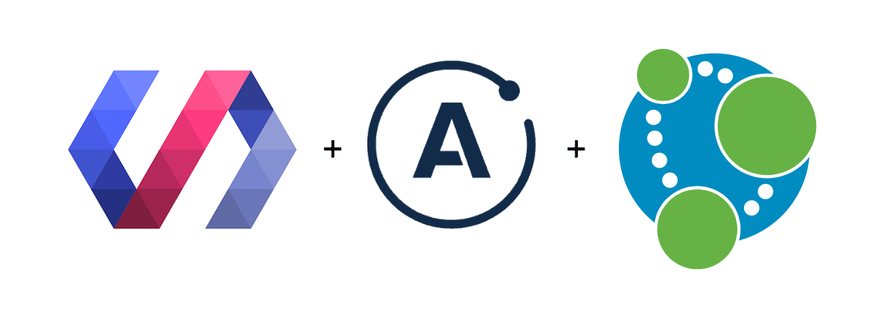
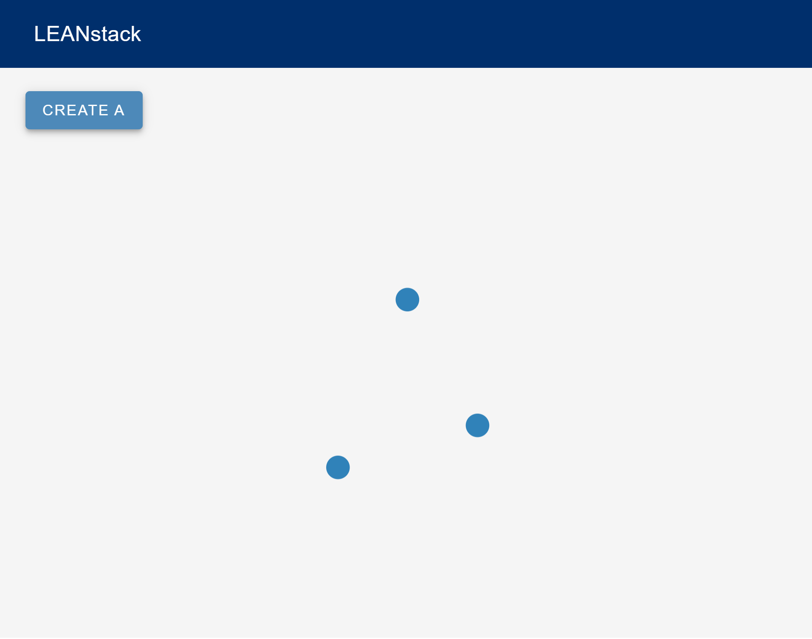

## LEANstack

<b>L</b>it-<b>E</b>lement <b>A</b>pollo <b>N</b>eo4j

### Lean:
  * _noun_: a deviation from the perpendicular; an inclination.
  * _adjective_: (of an industry or company) efficient and with no waste. 
  * _verb_: be in or move into a sloping position.

The LEANstack project exists to serve as an evolving knowledge base of resources and examples for using the following resources together:

* 🌐 [LitElement](https://lit-element.polymer-project.org/) web components and tools from the [Polymer Project](https://www.polymer-project.org/) for building [Progressive Web Apps](https://web.dev/progressive-web-apps/).

* 🚀 [Apollo GraphQL](https://www.apollographql.com/) client and server resources.

* 🌎 [Neo4j](https://neo4j.com/product/) graph databases using [neo4j-graphql-js](https://grandstack.io/docs/neo4j-graphql-js) from the [GRANDstack](https://grandstack.io/) project to [augment](https://grandstack.io/docs/graphql-schema-generation-augmentation) and [translate](https://grandstack.io/docs/guide-graphql-schema-design) GraphQL to [Cypher](https://neo4j.com/developer/cypher/).

### How It's Made
This repository begins as a modified combination of the following two starter kits:

* The root directory was generated using the  `npx create-grandstack-app` script from the [GRANDstack Starter Kit](https://grandstack.io/docs/getting-started-grand-stack-starter/).

* The `/web` directory was generated using the `npm init @apollo-elements` script from the [Apollo Elements App Generator](https://apolloelements.dev/pages/guides/getting-started#apollo-elements-app-generator).

### Installation
#### Neo4j
Follow [these instructions](https://github.com/grand-stack/grand-stack-starter#option-two---desktop) for installing Neo4j Desktop. The expected the username (neo4j) and password (letmein) are the same as those set in the [environment variables](https://github.com/grand-stack/grand-stack-starter#api) of the [GRANDstack starter kit](https://grandstack.io/docs/getting-started-grand-stack-starter).

#### Dependencies
Run `npm run install` in the root, `/api`, and `/web` directories.

#### Demo
Run `npm run start` in the root directory to start a [Apollo Server](https://www.npmjs.com/package/apollo-server) for the [Neo4j-GraphQL](#apollo-server-+-neo4j) API.

Run `npm run start` in `/web` to start the [Web Dev Server](#development-server) and launch the web application.

The below UI should load once the application is launched in `/web`. If you're Neo4j database is running and your is api started, you should see nodes appear in a [force-graph](https://github.com/vasturiano/force-graph) when you press the `CREATE A` button.

### The Front-End
#### Web Components + Apollo Client
The [Apollo Elements](https://apolloelements.dev/) project develops many invaluable resources for using Apollo client with LitElement. Typescript definitions are available using the [@apollo-elements/interfaces](https://apolloelements.dev/modules/_apollo_elements_interfaces.html) package.

##### ⊚ Class-Based Components

When writing [class-based LitElement](https://lit-element.polymer-project.org/guide/templates) components, you can use [@apollo-elements/lit-apollo](https://www.npmjs.com/package/@apollo-elements/lit-apollo) to extend [base classes](https://apolloelements.dev/modules/_apollo_elements_lit_apollo.html) for using Apollo client. 

Everything from the [LitElement API](https://lit-element.polymer-project.org/api/modules/_lit_element_.html) is also exported, including the following TypeScript [class decorators](https://lit-element.polymer-project.org/guide/decorators), and template tags for [html](https://lit-element.polymer-project.org/api/modules/_lit_element_.html#html) and [css](https://lit-element.polymer-project.org/api/modules/_lit_element_.html#css).

* [@customElement](https://lit-element.polymer-project.org/api/modules/_lit_element_.html#customelement) - Define a custom element.
* [@eventOptions](https://lit-element.polymer-project.org/api/modules/_lit_element_.html#eventoptions) - Add event listener options for a declarative event listener.
* [@property](https://lit-element.polymer-project.org/api/modules/_lit_element_.html#property) and [@internalProperty](https://lit-element.polymer-project.org/api/modules/_lit_element_.html#internalproperty) - Define properties.
* [@query](https://lit-element.polymer-project.org/api/modules/_lit_element_.html#query), [@queryAll](https://lit-element.polymer-project.org/api/modules/_lit_element_.html#queryAll), and [@queryAsync](https://lit-element.polymer-project.org/api/modules/_lit_element_.html#queryAsync) - Create a property getter that returns specific elements from your component’s render root.
* [@queryAssignedNodes](https://lit-element.polymer-project.org/api/modules/_lit_element_.html#queryAssignedNodes) - Create a property getter that returns the children assigned to a specific slot.

##### 👻 Functional Components + Hooks
You can write functional LitElement components using [Haunted](https://open-wc.org/guides/developing-components/code-examples/#haunted), which provides hooks such as [useState](https://github.com/matthewp/haunted#usestate), [useEffect](https://github.com/matthewp/haunted#useeffect), etc. To use Apollo client with functional components, the [@apollo-elements/haunted](https://apolloelements.dev/modules/_apollo_elements_haunted.html) package exports hooks such as [useQuery](https://apolloelements.dev/modules/_apollo_elements_haunted.html#-queries), similar to those for using [Apollo with React](https://www.apollographql.com/docs/react/api/react/hooks/#usequery).

##### 👨‍🚀 Apollo Components
The [@apollo-elements/components](https://www.npmjs.com/package/@apollo-elements/components) package provides LitElement [web components](https://apolloelements.dev/modules/_apollo_elements_components.html) that can be used in the html template of either class-based or functional components: [\<apollo-client>](https://apolloelements.dev/modules/_apollo_elements_components.html#apollo-client) and [\<apollo-mutation>](https://apolloelements.dev/modules/_apollo_elements_components.html#apollo-mutation).

### The Back-End
#### Apollo Server + Neo4j
The integration between [GraphQL](https://graphql.org/graphql-js/) and the [Cypher Query Language](https://neo4j.com/developer/cypher/) used by Neo4j is driven by the [neo4j-graphql-js](https://www.npmjs.com/package/neo4j-graphql-js) package from the [GRANDstack](https://grandstack.io/docs/neo4j-graphql-js) project.

#### Development Server
The [Web Dev Server](https://modern-web.dev/docs/dev-server/overview/) from the [Modern Web](https://modern-web.dev/) project is used to support [buildless development](https://open-wc.org/guides/developing-components/going-buildless/) with live-reload while using TypeScript and Rollup. It is the successor of the [es-dev-server](https://www.npmjs.com/package/es-dev-server) from the [Open Web Components](https://open-wc.org/) project.

To support using [@web/dev-server](https://www.npmjs.com/package/@web/dev-server) with Apollo Elements, this [configuration](https://apolloelements.dev/pages/guides/getting-started/buildless-development.html) is used for the `web-dev-server.config.mjs` file.

#### Recommended VS Code Extensions
  * [lit-html](https://marketplace.visualstudio.com/items?itemName=bierner.lit-html)
  * [es6-string-css](https://marketplace.visualstudio.com/items?itemName=bashmish.es6-string-css)
  * [GraphQL](https://marketplace.visualstudio.com/items?itemName=GraphQL.vscode-graphql)
  * [Cypher Query Language Tools for Neo4j](https://marketplace.visualstudio.com/items?itemName=AnthonyJGatlin.vscode-cypher-query-language-tools)
  * [Prettier ESLint](https://marketplace.visualstudio.com/items?itemName=rvest.vs-code-prettier-eslint)
